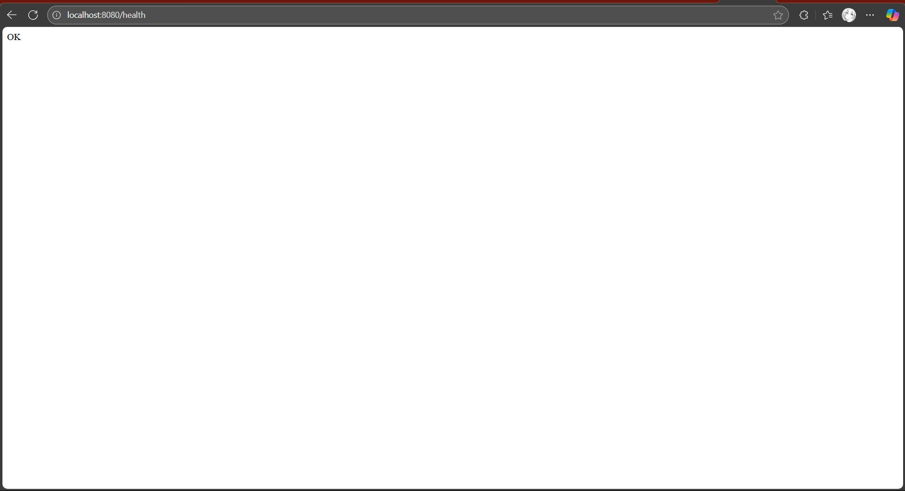
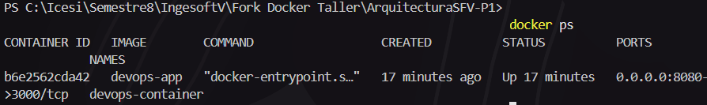

# ArquitecturaSFV-P1

# Evaluación Práctica - Ingeniería de Software V

## Información del Estudiante
- **Nombre: Felipe Rojas Prado**
- **Código: A00393918**
- **Fecha: 6/Agosto/2025**

## Resumen de la Solución
Inicialmente debemos realizar el Dockerfile donde se tiene en cuenta una version de Node:18-alpine (Es una liviana para el caso del proceso) entre otros parametros y se crea un archi Script.ps1 que permite probar en su totalidad la aplicacion desde crearla y eliminarla.

## Dockerfile
Primero se eligio una version de Node liviana vista por internet, tambien se pudo solo dejar Node para descargar la mas actualizda, se le pasa el packgage.json donde tiene la informacion del proyecto y el workDirectory que seria la app.js ademas de las dependencias necesarias para poder correr la aplicacion. Por otro lado, se le indica que instale esas depencias con NPM, se le indico un puerto donde se expone y se le indica por ultimo cuando arranque el contenedor ejecute la app con npm.

## Script de Automatización
El script se basa en 5 pasos:
1. Verificacion de si docker existe
2. Verificar si docker esta ejecutandose
3. Hace la construccion de la imagen
4. Verificar si el contenedor existe, si es asi la elimina y la vuelve a cargar
5. Se hace una prueba del servicio y se puede corroborar con /health, si responde con un 200 Ok.

## Principios DevOps Aplicados
1. **Automatización**: El script automatiza todo el proceso de construcción, despliegue y pruebas de la aplicación
2. **Contenerización**: Uso de Docker para empaquetar la aplicación con todas sus dependencias
3. **Fail Fast**: El script detecta errores rápidamente y se detiene si algo falla

## Captura de Pantalla

## Mejoras Futuras
1. **CI/CD Pipeline**: Implementar GitHub Actions para automatizar construcción y despliegue
2. **Monitoreo y Logging**: Agregar herramientas como logs estructurados
3. **Multi-stage Build**: Optimizar Dockerfile con builds multi-etapa para reducir tamaño de imagen

## Instrucciones para Ejecutar

Ejecute el script:

./Script.ps1